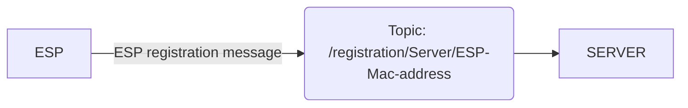
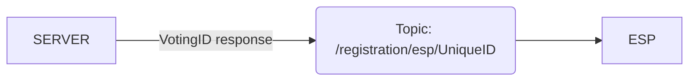

# Light flask server.

This is a light version of the flask server made for the ESP team to enable testing.

# Requirements.

The server requires all of the following installed on the machine running the server.
- Python 3.x (minimum 3.8+)
- Flask module  (https://flask.palletsprojects.com/en/3.0.x/installation/)
- Flask-mqtt module  (https://pypi.org/project/Flask-MQTT/)
- Mosquitto MQTT broker

## Features.

The server includes a light version of the ESP registration process and a template for custom tests using the **/test/server/receive_message** and **/test/est/send_message topics**.

## Registration process flowchart.
ESP initiates registration process

Server responds to registration

## Setup
Install mosquitto from https://mosquitto.org/download/ by following the official instructions. Once mosquitto is up and running on the machine simply run the code for the flask server on the machine. You can confirm if the flask server is setup by opening http://127.0.0.1:5000.
